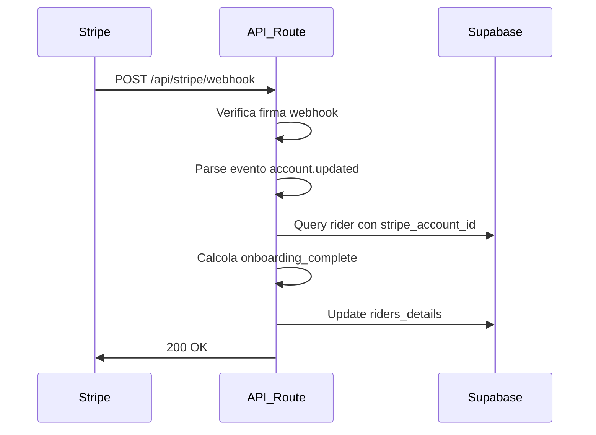

# Supabase Edge Functions

Documentazione completa per le Edge Functions di bemyrider.

## 📋 Panoramica

Le Edge Functions sono funzioni serverless che girano su Deno runtime e gestiscono:
- Webhook di Stripe per aggiornamenti automatici
- Elaborazione asincrona di eventi
- Integrazione con servizi esterni

## 🔧 Stripe Webhook Handler

### Scopo
Gestisce i webhook di Stripe per aggiornare automaticamente lo stato di onboarding dei rider nel database.

### Implementazione Attuale
**✅ API Route su Vercel (Raccomandata)**
```
https://bemyrider.vercel.app/api/stripe/webhook
app/api/stripe/webhook/route.ts
```

### Implementazione Alternativa
**⚠️ Edge Function Supabase (Deprecata)**
```
https://uolpvxgcobjefivqnscj.supabase.co/functions/v1/stripe-webhook
supabase/functions/stripe-webhook/index.ts
```

### Eventi Gestiti
- `account.updated` - Aggiorna `stripe_onboarding_complete` quando cambia lo stato dell'account

### Flusso di Elaborazione



## 🚀 Deployment

### 1. Prerequisiti

```bash
# Installa Supabase CLI
npm install -g @supabase/cli

# Login
supabase login

# Link progetto
supabase link --project-ref your-project-ref
```

### 2. Deploy Function

```bash
# Deploy la function
supabase functions deploy stripe-webhook

# Verifica deployment
supabase functions list
```

### 3. Configura Environment Variables

```bash
# Configura secrets per la function
supabase secrets set STRIPE_SECRET_KEY=***REMOVED***... --project-ref your-project-ref
supabase secrets set STRIPE_WEBHOOK_SECRET=***REMOVED***... --project-ref your-project-ref
supabase secrets set SUPABASE_URL=https://your-project.supabase.co --project-ref your-project-ref
supabase secrets set ***REMOVED***=eyJ... --project-ref your-project-ref

# Verifica secrets
supabase secrets list --project-ref your-project-ref
```

## ⚙️ Configurazione

### Environment Variables Richieste

| Variabile | Descrizione | Esempio |
|-----------|-------------|---------|
| `STRIPE_SECRET_KEY` | Chiave segreta Stripe | `***REMOVED***...` |
| `STRIPE_WEBHOOK_SECRET` | Secret per verifica firma | `***REMOVED***...` |
| `SUPABASE_URL` | URL progetto Supabase | `https://xyz.supabase.co` |
| `***REMOVED***` | Service role key | `eyJ...` |

### Configurazione Stripe Webhook

1. Vai su [Stripe Dashboard](https://dashboard.stripe.com/webhooks)
2. Clicca **Add endpoint**
3. URL: `https://your-project-ref.supabase.co/functions/v1/stripe-webhook`
4. Eventi: `account.updated`
5. Copia il **Signing secret**

### Configurazione Supabase

1. Vai su **Edge Functions** nel dashboard Supabase
2. Trova la function `stripe-webhook`
3. **Disabilita** "Verify JWT" (Stripe non invia JWT)
4. Verifica che sia **attiva**

## 🧪 Testing

### 1. Test Locale

```bash
# Avvia function localmente
supabase functions serve stripe-webhook --no-verify-jwt

# In un altro terminale, test con curl
curl -X POST http://localhost:54321/functions/v1/stripe-webhook \
  -H "Content-Type: application/json" \
  -H "Stripe-Signature: t=test,v1=test" \
  -d '{"type":"account.updated","data":{"object":{"id":"acct_test"}}}'
```

### 2. Test con Stripe CLI

```bash
# Installa Stripe CLI
brew install stripe/stripe-cli/stripe

# Login
stripe login

# Forward events alla function
stripe listen --forward-to https://your-project.supabase.co/functions/v1/stripe-webhook

# Trigger test event
stripe trigger account.updated
```

### 3. Test Produzione

```bash
# Verifica logs della function
supabase functions logs stripe-webhook --project-ref your-project-ref

# Test con webhook reale da Stripe Dashboard
# Vai su Webhooks → Il tuo endpoint → Send test webhook
```

## 📊 Monitoring

### Logs

```bash
# Visualizza logs in tempo reale
supabase functions logs stripe-webhook --project-ref your-project-ref --follow

# Logs con filtro
supabase functions logs stripe-webhook --project-ref your-project-ref --level error
```

### Metriche

Nel Supabase Dashboard:
1. **Edge Functions** → **stripe-webhook**
2. Visualizza:
   - **Invocations**: Numero di chiamate
   - **Errors**: Rate di errore
   - **Duration**: Tempo di esecuzione
   - **Memory**: Utilizzo memoria

## 🔍 Debugging

### Errori Comuni

#### 1. Webhook Signature Verification Failed
```
❌ Webhook signature verification failed
```

**Causa**: `STRIPE_WEBHOOK_SECRET` non configurato o errato

**Soluzione**:
```bash
# Verifica secret
supabase secrets list --project-ref your-project-ref

# Aggiorna secret
supabase secrets set STRIPE_WEBHOOK_SECRET=***REMOVED***correct_secret
```

#### 2. Missing Authorization Header
```
{"code":401,"message":"Missing authorization header"}
```

**Causa**: "Verify JWT" è abilitato

**Soluzione**: Disabilita "Verify JWT" nelle impostazioni function

#### 3. Rider Not Found
```
❌ Error finding rider with Stripe account: acct_xxx
```

**Causa**: Account Stripe non collegato a nessun rider nel database

**Soluzione**: Verifica che `stripe_account_id` sia corretto nella tabella `riders_details`

#### 4. Supabase Configuration Error
```
❌ Supabase environment variables not configured
```

**Causa**: `SUPABASE_URL` o `***REMOVED***` mancanti

**Soluzione**:
```bash
supabase secrets set SUPABASE_URL=https://your-project.supabase.co
supabase secrets set ***REMOVED***=your_service_role_key
```

### Debug Mode

Per debug dettagliato, modifica temporaneamente la function:

```typescript
// Aggiungi all'inizio della function
console.log('🔍 Debug - Headers:', Object.fromEntries(req.headers.entries()));
console.log('🔍 Debug - Body:', body);
console.log('🔍 Debug - Environment:', {
  hasStripeSecret: !!Deno.env.get('STRIPE_SECRET_KEY'),
  hasWebhookSecret: !!Deno.env.get('STRIPE_WEBHOOK_SECRET'),
  hasSupabaseUrl: !!Deno.env.get('SUPABASE_URL'),
  hasServiceKey: !!Deno.env.get('***REMOVED***')
});
```

## 🔐 Sicurezza

### Best Practices

1. **Verifica Firma**: Sempre verificare la firma Stripe
2. **Environment Variables**: Mai hardcodare secrets
3. **Error Handling**: Non esporre dettagli interni negli errori
4. **Rate Limiting**: Implementare se necessario

### Validazione Input

```typescript
// Esempio di validazione robusta
if (!signature || signature.length < 10) {
  return new Response('Invalid signature', { status: 400 });
}

if (!body || body.length === 0) {
  return new Response('Empty body', { status: 400 });
}
```

## 📈 Performance

### Ottimizzazioni

1. **Caching**: Cache delle query frequenti
2. **Batch Updates**: Raggruppa aggiornamenti simili
3. **Async Processing**: Per operazioni pesanti

### Limiti

- **Timeout**: 60 secondi max
- **Memory**: 512MB max
- **Payload**: 6MB max

## 🔄 Versioning

### Deployment Strategy

```bash
# Deploy con tag versione
git tag edge-function-v1.1.0
supabase functions deploy stripe-webhook --project-ref prod-ref

# Rollback se necessario
git checkout edge-function-v1.0.0
supabase functions deploy stripe-webhook --project-ref prod-ref
```

### Changelog Function

- **v1.0.0**: Implementazione base account.updated
- **v1.1.0**: Aggiunto error handling migliorato
- **v1.2.0**: Supporto per eventi payment_intent

## 📞 Supporto

### Escalation

1. **Logs**: Controlla sempre i logs prima
2. **Stripe Dashboard**: Verifica webhook delivery
3. **Supabase Support**: Per problemi di runtime
4. **GitHub Issues**: Per bug nel codice

### Contatti

- **Email**: dev@bemyrider.it
- **GitHub**: [bemyrider/bemyrider](https://github.com/bemyrider/bemyrider)
- **Supabase Community**: [Discord](https://discord.supabase.com/)

---

## ✅ Checklist Edge Function

Prima del deploy in produzione:

- [ ] Function deployata e attiva
- [ ] Environment variables configurate
- [ ] Webhook Stripe configurato correttamente
- [ ] "Verify JWT" disabilitato
- [ ] Test con Stripe CLI completato
- [ ] Logs di produzione verificati
- [ ] Error handling testato
- [ ] Monitoring configurato
