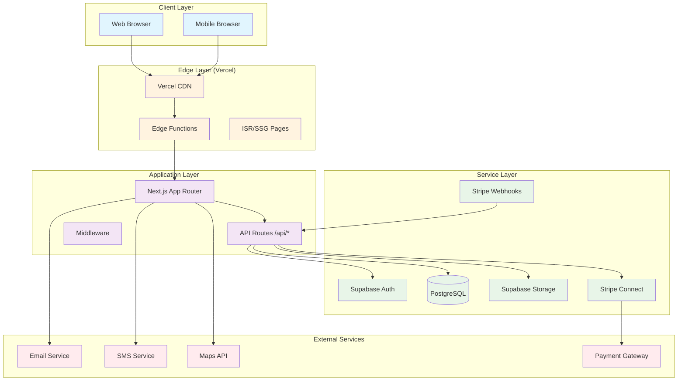
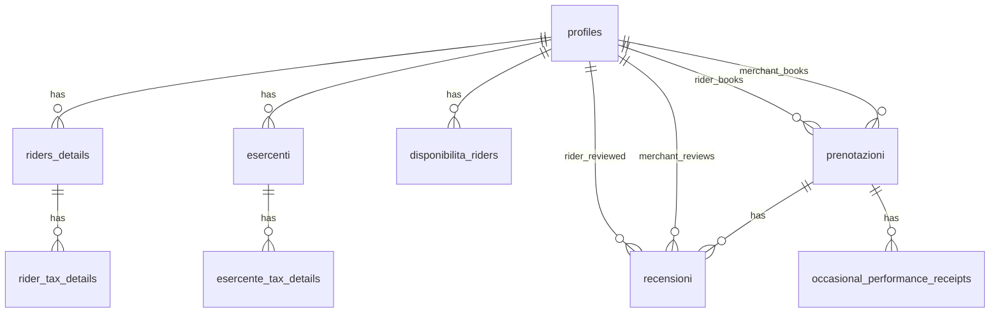

# 🏗️ Architettura del Progetto bemyrider

Questa sezione descrive l'architettura completa di bemyrider, includendo frontend, backend, database, sicurezza e integrazioni esterne.

## 📋 Panoramica Architetturale

bemyrider è una piattaforma marketplace B2B che connette rider professionisti con esercenti locali, utilizzando un'architettura moderna basata su microservizi e cloud-native technologies.

### Stack Tecnologico Principale
- **Frontend:** Next.js 14, React 18, TypeScript
- **Backend:** Supabase (PostgreSQL, Auth, Storage, Edge Functions)
- **Pagamenti:** Stripe Connect Express
- **UI/UX:** Tailwind CSS, shadcn/ui, Radix UI
- **Database:** PostgreSQL con Drizzle ORM
- **Deployment:** Vercel (Edge Network)
- **Monitoring:** Vercel Analytics, Sentry

## 🏛️ Diagramma Architetturale



## 🗄️ Schema Database

### Tabelle Principali

#### **profiles** - Profili Utenti Base
```sql
CREATE TABLE "profiles" (
    "id" uuid PRIMARY KEY DEFAULT gen_random_uuid(),
    "full_name" varchar(255) NOT NULL,
    "avatar_url" varchar(255),
    "role" text NOT NULL, -- 'rider' | 'merchant'
    "created_at" timestamptz DEFAULT now(),
    "updated_at" timestamptz DEFAULT now()
);
```

#### **riders_details** - Dettagli Rider
```sql
CREATE TABLE "riders_details" (
    "profile_id" uuid PRIMARY KEY,
    "first_name" varchar(100),
    "last_name" varchar(100),
    "bio" text,
    "hourly_rate" numeric(10,2) NOT NULL,
    "avg_rating" numeric(3,2) DEFAULT 0.00,
    "vehicle_type" VehicleType, -- 'bici' | 'e_bike' | 'scooter' | 'auto'
    "stripe_account_id" text,
    "stripe_onboarding_complete" boolean DEFAULT false,
    "profile_picture_url" varchar(255),
    "portfolio_images" text[] DEFAULT '{}',
    "certifications" text[] DEFAULT '{}',
    "portfolio_url" text,
    "services_description" text,
    "portfolio_updated_at" timestamptz DEFAULT now(),
    "created_at" timestamptz DEFAULT now(),
    "updated_at" timestamptz DEFAULT now()
);
```

#### **esercenti** - Profili Esercenti
```sql
CREATE TABLE "esercenti" (
    "id" uuid PRIMARY KEY,
    "business_name" varchar(255) NOT NULL,
    "address" varchar(255),
    "city" varchar(100),
    "phone_number" varchar(20),
    "description" text,
    "profile_picture_url" varchar(255)
);
```

#### **prenotazioni** - Prenotazioni Servizio
```sql
CREATE TABLE "prenotazioni" (
    "id" uuid PRIMARY KEY DEFAULT gen_random_uuid(),
    "esercente_id" uuid NOT NULL,
    "rider_id" uuid NOT NULL,
    "start_time" timestamptz NOT NULL,
    "end_time" timestamptz NOT NULL,
    "service_duration_hours" numeric(5,2) NOT NULL,
    "gross_amount" numeric(10,2) NOT NULL,
    "tax_withholding_amount" numeric(10,2),
    "net_amount" numeric(10,2) NOT NULL,
    "status" Status NOT NULL, -- 'in_attesa' | 'confermata' | 'in_corso' | 'completata' | 'annullata'
    "payment_status" PaymentStatus NOT NULL, -- 'in_attesa' | 'pagato' | 'rimborsato'
    "created_at" timestamptz DEFAULT now()
);
```

#### **disponibilita_riders** - Disponibilità Rider
```sql
CREATE TABLE "disponibilita_riders" (
    "id" uuid PRIMARY KEY DEFAULT gen_random_uuid(),
    "rider_id" uuid NOT NULL,
    "day_of_week" DayOfWeek NOT NULL, -- 'Lun' | 'Mar' | 'Mer' | 'Gio' | 'Ven' | 'Sab' | 'Dom'
    "start_time" time NOT NULL,
    "end_time" time NOT NULL
);
```

#### **recensioni** - Sistema Recensioni
```sql
CREATE TABLE "recensioni" (
    "id" uuid PRIMARY KEY DEFAULT gen_random_uuid(),
    "prenotazione_id" uuid NOT NULL UNIQUE,
    "esercente_id" uuid NOT NULL,
    "rider_id" uuid NOT NULL,
    "rating" integer NOT NULL, -- 1-5 stars
    "comment" text,
    "created_at" timestamptz DEFAULT now()
);
```

### Tabelle Fiscali/Tax
```sql
-- Rider fiscal details
CREATE TABLE "rider_tax_details" (
    "rider_id" uuid PRIMARY KEY,
    "fiscal_code" varchar(50),
    "birth_place" varchar(100),
    "birth_date" date,
    "residence_address" varchar(255),
    "residence_city" varchar(100)
);

-- Merchant fiscal details
CREATE TABLE "esercente_tax_details" (
    "esercente_id" uuid PRIMARY KEY,
    "company_name" varchar(255),
    "vat_number" varchar(50),
    "address" varchar(255),
    "city" varchar(100)
);

-- Occasional performance receipts (Ricevute occasionali)
CREATE TABLE "occasional_performance_receipts" (
    "id" uuid PRIMARY KEY DEFAULT gen_random_uuid(),
    "prenotazione_id" uuid NOT NULL UNIQUE,
    "receipt_number" integer NOT NULL,
    "receipt_date" date NOT NULL
);
```

### Relazioni Database


## 🔐 Sicurezza e Autenticazione

### Row Level Security (RLS)
- **Policy per profilo**: Utenti possono vedere/modificare solo i propri dati
- **Policy per prenotazioni**: Rider vedono solo prenotazioni proprie, merchant vedono solo le proprie richieste
- **Policy per recensioni**: Solo gli utenti coinvolti possono vedere/modificare

### Autenticazione
- **JWT Tokens**: Gestiti automaticamente da Supabase
- **Session Management**: Automatico con refresh tokens
- **Multi-factor**: Supportato tramite Supabase Auth

### Sicurezza Pagamenti
- **PCI Compliance**: Gestito da Stripe
- **Webhook Verification**: Firma digitale per tutti i webhook
- **Idempotency**: Prevenzione duplicati nelle transazioni

## 🚀 Performance e Scalabilità

### Ottimizzazioni Frontend
- **ISR/SSG**: Pagine statiche dove possibile
- **Code Splitting**: Lazy loading dei componenti
- **Image Optimization**: Next.js Image component
- **Bundle Analysis**: Monitoraggio dimensione bundle

### Ottimizzazioni Database
- **Indici**: Su colonne frequentemente queryate
- **Connection Pooling**: Gestito da Supabase
- **Query Optimization**: Utilizzo Drizzle per query tipizzate
- **Caching**: Redis per dati ad alto volume (futuro)

### CDN e Edge Computing
- **Vercel Edge Network**: Distribuzione globale
- **Edge Functions**: Elaborazione vicina all'utente
- **Caching Strategico**: Cache headers appropriati

## 🔄 Flussi Applicativi Dettagliati

### Flusso Registrazione Rider
1. **Signup**: Creazione account Supabase Auth
2. **Profile Creation**: Inserimento dati base in `profiles`
3. **Rider Details**: Completamento `riders_details`
4. **Stripe Onboarding**: Creazione Stripe Connect account
5. **Availability Setup**: Configurazione `disponibilita_riders`
6. **Tax Details**: Inserimento dati fiscali

### Flusso Prenotazione
1. **Service Request**: Merchant crea richiesta
2. **Notification**: Rider riceve notifica
3. **Response**: Rider accetta/rifiuta
4. **Payment Intent**: Creazione payment con Stripe
5. **Confirmation**: Prenotazione confermata
6. **Service Delivery**: Esecuzione servizio
7. **Payment**: Rilascio pagamento al rider

### Flusso Pagamento
1. **Payment Intent Creation**: Server crea intent
2. **Client Confirmation**: Frontend conferma pagamento
3. **Stripe Processing**: Elaborazione sicura
4. **Webhook**: Aggiornamento stato prenotazione
5. **Payout**: Rilascio fondi al rider (T+2 giorni)

## 📊 Monitoraggio e Observabilità

### Application Monitoring
- **Vercel Analytics**: Performance e usage metrics
- **Error Tracking**: Sentry per error monitoring
- **Uptime Monitoring**: External monitoring services

### Database Monitoring
- **Supabase Dashboard**: Query performance e usage
- **Slow Query Log**: Identificazione bottleneck
- **Connection Monitoring**: Pool usage e limits

### Business Metrics
- **Conversion Funnel**: Signup → Onboarding → First booking
- **Revenue Tracking**: Booking volume e ARPU
- **User Engagement**: Session duration, feature usage

## 🔧 DevOps e Deployment

### CI/CD Pipeline
- **GitHub Integration**: Automatic deployment su main
- **Environment Management**: Preview deployments per PR
- **Rollback Strategy**: Version pinning e instant rollback

### Environment Strategy
- **Development**: Locale con hot reload
- **Staging**: Mirror produzione per testing
- **Production**: Full monitoring e backup

### Backup e Recovery
- **Database Backup**: Automatico con point-in-time recovery
- **Code Backup**: Git versioning
- **Asset Backup**: Supabase storage replication

## 🎯 Decisioni Architetturali Chiave

### Perché Next.js 14?
- **Full-Stack**: API routes integrate frontend/backend
- **Performance**: ISR, SSG, ottimizzazioni automatiche
- **Developer Experience**: TypeScript nativo, hot reload
- **Edge Computing**: Deployment globale ottimizzato

### Perché Supabase?
- **Integrated Stack**: Auth, Database, Storage, Edge Functions
- **PostgreSQL**: Database robusto e scalabile
- **Real-time**: Sottoscrizioni per aggiornamenti live
- **Security**: RLS e policy integrate

### Perché Stripe Connect?
- **Regulatory Compliance**: Gestione completa compliance PCI
- **Multi-party Payments**: Marketplace payment flow
- **Global Coverage**: Supporto internazionale
- **Developer Friendly**: API robusta e documentazione

### Perché Drizzle ORM?
- **Type Safety**: Query tipizzate con TypeScript
- **Performance**: Query ottimizzate e leggere
- **Migration System**: Versionamento schema sicuro
- **Developer Experience**: Auto-completion e linting

Questa architettura garantisce scalabilità, sicurezza e manutenibilità per supportare la crescita di bemyrider come piattaforma leader nel mercato dei rider professionisti.
